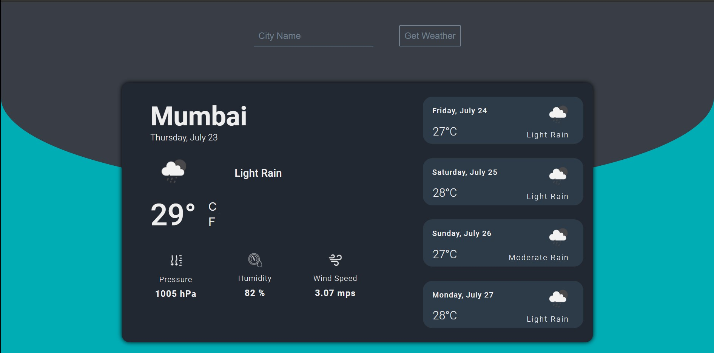

# Weather Forecast WebApp

Demo Link: https://weather-forecast-web.herokuapp.com

## Welcome! 👋

Thanks for checking out this project.

## Main Project

This is a weather forecast web application. It shows 5 days forecast. For the back end, I have used Node js, Express, EJS and for the front end HTML, CSS, and a bit of Javascript. I have used OpenWeatherMap for the weather API. To run this app get an API key by signing up with OpenWeatherMap then you can generate your own API key and paste it inside the ".env_sample" file and change the file name ti .env. To hide your API key create a new file ".gitignore" and write the file name you want to hide, in our case it's ".env".

## Deploying your project

There are a number of ways to host your project for free. I am using [Heroku](https://heroku.com) as it's an amazing service and extremely simple to get set up with.

## Giving feedback

Feedback is always welcome and please share it with anyone who will find it useful for practice.
You can also contribute to this project.
